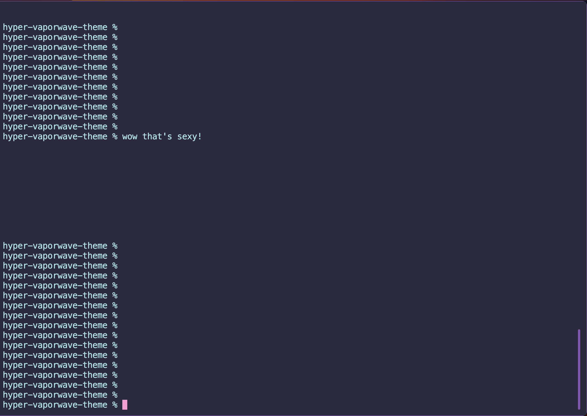

```
# Hyper Vaporwave Theme 🌸

A Vaporwave inspired theme for [Hyper](https://hyper.is/) terminal.



## Installation

1. Open Hyper terminal, press `Cmd+,` or `Ctrl+,` to open the preferences file `~/.hyper.js`.
2. Add `'hyper-vaporwave-theme'` to the `plugins` array:

```javascript
plugins: ['hyper-vaporwave-theme'],
```

3. Save the `~/.hyper.js` file, and Hyper should reload with the new Vaporwave theme applied.

## Manual Installation

1. Clone this repository or download the files.
2. Open your Hyper terminal, press `Cmd+,` or `Ctrl+,` to open the preferences file `~/.hyper.js`.
3. Add the local path to the `hyper-vaporwave-theme` directory to the `localPlugins` array:

```javascript
localPlugins: ['path/to/your/hyper-vaporwave-theme'],
```

4. Save the `~/.hyper.js` file, and Hyper should reload with the new Vaporwave theme applied.

## License

MIT © [Beau](https://github.com/beaudjango)
```
